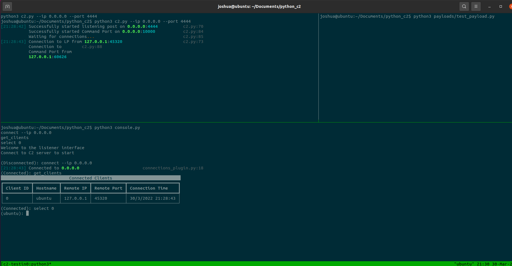

# python_c2

## Usage

If you have tmux installed and want to test the c2 suite locally just run the [testing script](testing.sh) to open a tmux session running the [payload](payloads/test_payload.py), [C2 Server](c2.py), and the [user console](console.py) in seperate tmux panes.

